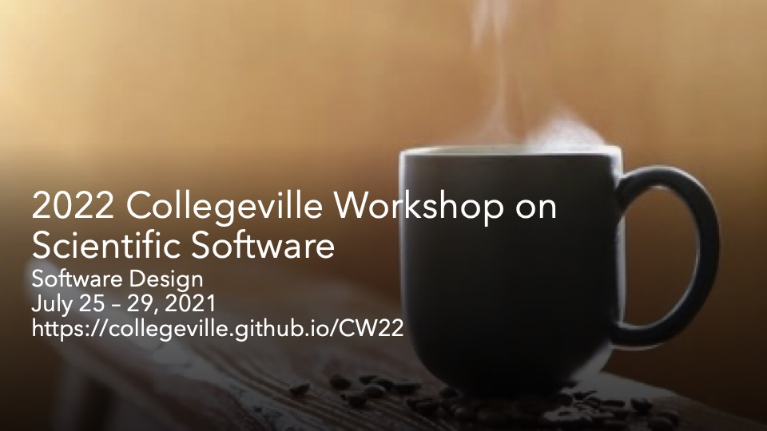

# Collegeville 2022 Home

### Details
- [**About**](About.md)
- [**Background**](Background.md)
- [**Workshop Goals and Format**](GoalsFormat.md)

- [**Resources**](Resources.md)
  - [**Recordings**](WorkshopResources/Recordings/RecordingList.md)
  - [**Teatime Themes**](WorkshopResources/TeatimeThemes/TeatimeThemeList.md)
  - [**White Papers**](WorkshopResources/WhitePapers/WhitePaperList.md)
  - [**Panel Slides and Discussion Notes**](WorkshopResources/WorkshopSlidesNotes/WorkshopSlidesNotesList.md)

- [**Organizers**](Organizers.md)
- [**Attendees**](Attendees.md)

- [**Agenda Overview**](Agenda.md) -- TBD
  - [**Tuesday, July 26 Detailed Agenda**](Agenda-Day-1.md)
  - [**Wednesday, July 27 Detailed Agenda**](Agenda-Day-2.md)
  - [**Thursday, July 28 Detailed Agenda**](Agenda-Day-3.md)

- [**Sign up for Collegeville 2022!**](Registration2022.md)

- [**Collegeville Workshop Series**](https://collegeville.github.io/Workshops/)

- [**Contribute**](Contribute.md)
- [**Recorded Contributions Instructions**](WorkshopResources/Recordings/Instructions.md)

- Contact: [Mike Heroux](https://maherou.github.io)
